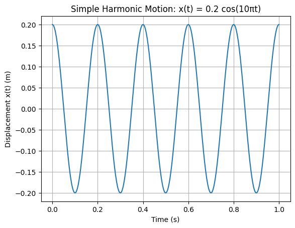

# 📘 Harmonic Motion — Spring System

---

## 🔑 Key Definitions and Formulas

### 📌 Equation of Simple Harmonic Motion

The motion is described by:

$$
x(t)=A\cos(\omega t)
$$

where:
- $A$ — amplitude
- $\omega$ — angular frequency
- $t$ — time

---

### 📌 Angular Frequency and Spring Constant

For a mass-spring system:

$$
\omega=\sqrt{\frac{k}{m}}
$$

From this:

$$
k=m\omega^2
$$

---

### 📌 Total Mechanical Energy

The total energy in SHM is constant and given by:

$$
E=\frac{1}{2}kA^2
$$

---

## 🧩 Given:

- $m=10\ \text{kg}$
- $x(t)=0.2\cos(10\pi t)$

So:
- $A=0.2\ \text{m}$
- $\omega=10\pi\ \text{rad/s}$

---

# 🔍 Part 1: Find Spring Constant $k$

###  Step 1: Use formula

$$
k=m\omega^2
$$

---

###  Step 2: Substitute values

$$
k=10\cdot(10\pi)^2
$$

---

###  Step 3: Simplify

$$
(10\pi)^2=100\pi^2
$$

$$
k=10\cdot100\pi^2=1000\pi^2
$$

---

###  Step 4: Numerical value

$$
k\approx1000\cdot9.87\approx9870\ \text{N/m}
$$

---

### ✅ Answer:

$$
k\approx9870\ \text{N/m}
$$

---

# 🔍 Part 2: Total Mechanical Energy

###  Step 1: Use formula

$$
E=\frac{1}{2}kA^2
$$

---

###  Step 2: Substitute values

$$
E=\frac{1}{2}\cdot1000\pi^2\cdot(0.2)^2
$$

---

###  Step 3: Simplify

$$
(0.2)^2=0.04
$$

$$
E=\frac{1}{2}\cdot1000\pi^2\cdot0.04
$$

$$
E=500\cdot0.04\cdot\pi^2=20\pi^2
$$

---

###  Step 4: Numerical value

$$
E\approx20\cdot9.87\approx197.4\ \text{J}
$$

---

### ✅ Answer:

$$
E\approx197\ \text{J}
$$

---

# 🎯 Final Results

- Spring constant:  
  $$k\approx9870\ \text{N/m}$$

- Total mechanical energy:  
  $$E\approx197\ \text{J}$$

---

