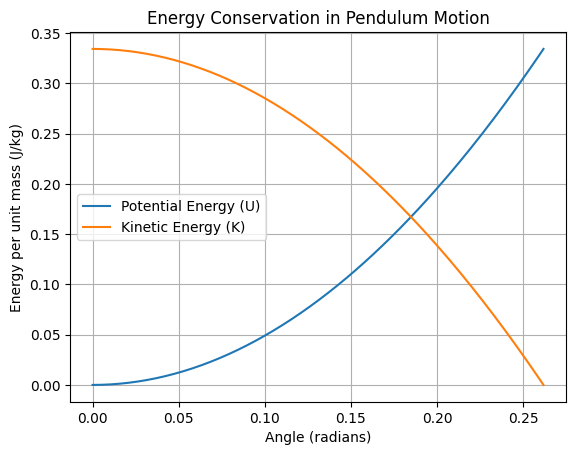

# 📘 Conservation of Energy — Pendulum Motion

---

## 🔑 Key Definitions and Formulas

### 📌 Mechanical Energy Conservation

For a pendulum (neglecting air resistance):

$$
E_{\text{total}}=E_{\text{potential}}+E_{\text{kinetic}}=\text{constant}
$$

---

### 📌 Gravitational Potential Energy

$$
U=mgh
$$

where:
- $h$ — vertical height relative to the lowest point

---

### 📌 Kinetic Energy

$$
K=\frac{1}{2}mv^2
$$

---

### 📌 Height of a Pendulum

For a pendulum released from angle $\theta$:

$$
h=L\left(1-\cos\theta\right)
$$

---

## 🧩 Given:

- $L=1.0\ \text{m}$
- $\theta=15^\circ$
- $g=9.81\ \text{m/s}^2$

---

# 🔍 Step 1: Apply Energy Conservation

At the top:
- $K=0$
- $U=mgh$

At the bottom:
- $U=0$
- $K=\frac{1}{2}mv^2$

So:

$$
mgh=\frac{1}{2}mv^2
$$

Mass cancels:

$$
gh=\frac{1}{2}v^2
$$

---

# 🔍 Step 2: Express Height $h$

$$
h=L\left(1-\cos\theta\right)
$$

Substitute:

$$
h=1.0\cdot\left(1-\cos15^\circ\right)
$$

---

# 🔍 Step 3: Calculate Height

$$
\cos15^\circ\approx0.966
$$

$$
h=1-0.966=0.034\ \text{m}
$$

---

# 🔍 Step 4: Solve for Velocity

From:

$$
gh=\frac{1}{2}v^2
$$

Multiply by 2:

$$
2gh=v^2
$$

$$
v=\sqrt{2gh}
$$

---

# 🔍 Step 5: Substitute Values

$$
v=\sqrt{2\cdot9.81\cdot0.034}
$$

$$
v=\sqrt{0.667}
$$

---

# 🔍 Step 6: Final Calculation

$$
v\approx0.82\ \text{m/s}
$$

---

## ✅ Final Answer:

$$
v\approx0.82\ \text{m/s}
$$

---

# 🎯 Conclusion

The speed of the pendulum bob at the lowest point depends only on:
- initial angle
- length
- gravity

Mass does **not** affect the result.

---
