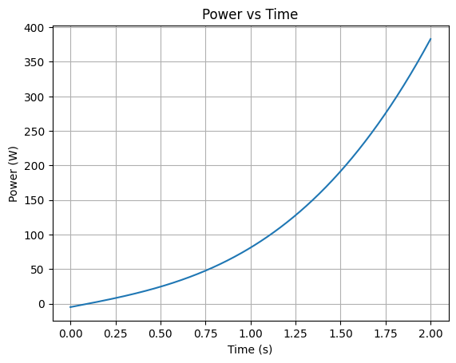

# 📘 Force Field and Power — Particle Motion

---

## 🔑 Key Definitions and Formulas

### 📌 Position Vector

$$
\vec{r}(t)=\left(x(t),y(t),z(t)\right)
$$

---

### 📌 Velocity

$$
\vec{v}(t)=\frac{d\vec{r}}{dt}
$$

---

### 📌 Acceleration

$$
\vec{a}(t)=\frac{d\vec{v}}{dt}
$$

---

### 📌 Momentum

$$
\vec{p}=m\vec{v}
$$

---

### 📌 Force (Newton’s Second Law)

$$
\vec{F}=m\vec{a}
$$

---

### 📌 Power

$$
P=\vec{F}\cdot\vec{v}
$$

(dot product of force and velocity)

---

## 🧩 Given:

- $m=0.5\ \text{kg}$

$$
x=5t^2-t,\quad y=2t^3,\quad z=-3t+2
$$

---

# 🔍 Step 1: Position Vector

$$
\vec{r}(t)=\left(5t^2-t,\;2t^3,\;-3t+2\right)
$$

---

# 🔍 Step 2: Velocity

Differentiate each component:

$$
v_x=\frac{d}{dt}(5t^2-t)=10t-1
$$

$$
v_y=\frac{d}{dt}(2t^3)=6t^2
$$

$$
v_z=\frac{d}{dt}(-3t+2)=-3
$$

---

### ✅ Velocity vector:

$$
\vec{v}(t)=\left(10t-1,\;6t^2,\;-3\right)
$$

---

# 🔍 Step 3: Acceleration

Differentiate velocity:

$$
a_x=\frac{d}{dt}(10t-1)=10
$$

$$
a_y=\frac{d}{dt}(6t^2)=12t
$$

$$
a_z=\frac{d}{dt}(-3)=0
$$

---

### ✅ Acceleration vector:

$$
\vec{a}(t)=\left(10,\;12t,\;0\right)
$$

---

# 🔍 Step 4: Momentum

$$
\vec{p}=m\vec{v}
$$

---

### 🔄 Substitute:

$$
\vec{p}(t)=0.5\cdot\left(10t-1,\;6t^2,\;-3\right)
$$

---

### ✅ Momentum:

$$
\vec{p}(t)=\left(5t-0.5,\;3t^2,\;-1.5\right)
$$

---

# 🔍 Step 5: Force

$$
\vec{F}=m\vec{a}
$$

---

### 🔄 Substitute:

$$
\vec{F}(t)=0.5\cdot\left(10,\;12t,\;0\right)
$$

---

### ✅ Force:

$$
\vec{F}(t)=\left(5,\;6t,\;0\right)
$$

---

# 🔍 Step 6: Power

$$
P=\vec{F}\cdot\vec{v}
$$

---

### 🔄 Compute dot product:

$$
P=5(10t-1)+6t(6t^2)+0\cdot(-3)
$$

---

### 🔄 Simplify:

$$
P=50t-5+36t^3
$$

---

### ✅ Final power:

$$
P(t)=36t^3+50t-5
$$

---

# 🎯 Final Results

- Velocity:
  
$$
\vec{v}(t)=\left(10t-1,\;6t^2,\;-3\right)
$$

- Acceleration:
  
$$
\vec{a}(t)=\left(10,\;12t,\;0\right)
$$

- Momentum:
  
$$
\vec{p}(t)=\left(5t-0.5,\;3t^2,\;-1.5\right)
$$

- Force:
  
$$
\vec{F}(t)=\left(5,\;6t,\;0\right)
$$

- Power:
  
$$
P(t)=36t^3+50t-5
$$

---
