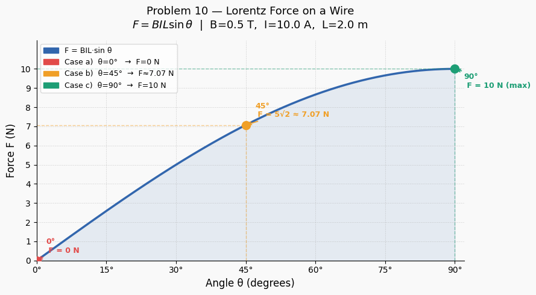

## 10. Lorentz Force Acting on Wire

---

### Useful Definitions and Formulas

- **Magnetic force on a current-carrying wire:**
$$\vec{F} = I\vec{L} \times \vec{B}$$
---
- **Magnitude:**
$$F = BIL\sin\theta$$

where:
- $I$ — current in the wire (A)
- $L$ — length of the wire (m)
- $B$ — magnetic field strength (T)
- $\theta$ — angle between the wire direction and $\vec{B}$
---
- **Special cases:**

| Angle $\theta$ | $\sin\theta$ | Force |
|---|---|---|
| $90°$ | $1$ | $F = BIL$ (maximum) |
| $45°$ | $\frac{\sqrt{2}}{2}$ | $F = \frac{\sqrt{2}}{2}BIL$ |
| $0°$ | $0$ | $F = 0$ (no force) |
---
- **Physical origin:** Each charge carrier $q$ moving with drift velocity $v_d$ experiences $\vec{F} = q\vec{v}_d \times \vec{B}$; summing over all carriers in the wire gives $F = BIL\sin\theta$.

---

### Given Values

$$L = 2.0\ \text{m}, \quad I = 10\ \text{A}, \quad B = 0.5\ \text{T}$$

**Compute the common prefactor first:**

$$BIL = 0.5 \times 10 \times 2.0 = 10\ \text{N}$$

> This prefactor is the same for all three cases — only $\sin\theta$ changes.

---

### Case a) $\theta = 90°$

**Step 1:** The wire is **perpendicular** to the field — maximum force configuration.

$$\sin 90° = 1$$

**Step 2:** Apply the formula:

$$F = BIL\sin 90° = 10 \times 1$$

$$\boxed{F_a = 10\ \text{N}}$$

> **Direction:** perpendicular to both the wire and $\vec{B}$, given by the right-hand rule.
> This is the **maximum possible force** for these parameters.

---

### Case b) $\theta = 45°$

**Step 1:** The wire is at $45°$ to the field — intermediate configuration.

$$\sin 45° = \frac{\sqrt{2}}{2} \approx 0.7071$$

**Step 2:** Apply the formula:

$$F = BIL\sin 45° = 10 \times \frac{\sqrt{2}}{2} = 5\sqrt{2}$$

$$\boxed{F_b = 5\sqrt{2} \approx 7.07\ \text{N}}$$

> This is exactly $\frac{1}{\sqrt{2}} \approx 70.7\%$ of the maximum force.

---

### Case c) $\theta = 0°$

**Step 1:** The wire is **parallel** to the field — zero force configuration.

$$\sin 0° = 0$$

**Step 2:** Apply the formula:

$$F = BIL\sin 0° = 10 \times 0$$

$$\boxed{F_c = 0\ \text{N}}$$

> **Physical explanation:** When the wire is parallel to $\vec{B}$, the current direction and field are collinear. The cross product $\vec{L} \times \vec{B} = \vec{0}$, so there is no force — the magnetic field exerts no sideways push on the charges moving along its own direction.

---

### Summary Table

$$\begin{array}{|c|c|c|c|}
\hline
\textbf{Case} & \boldsymbol{\theta} & \boldsymbol{\sin\theta} & \textbf{Force } F \\
\hline
\text{a)} & 90° & 1 & 10\ \text{N} \\
\hline
\text{b)} & 45° & \frac{\sqrt{2}}{2} & 5\sqrt{2} \approx 7.07\ \text{N} \\
\hline
\text{c)} & 0° & 0 & 0\ \text{N} \\
\hline
\end{array}$$

---

### Visual Summary

$$F(\theta) = BIL\sin\theta = 10\sin\theta\ \text{ [N]}$$

$$F(0°) = 0 \longrightarrow F(45°) = 7.07\ \text{N} \longrightarrow F(90°) = 10\ \text{N}$$

> **Key insight:** The force depends only on the **component of the wire perpendicular to $\vec{B}$**.
> A wire at angle $\theta$ behaves as if an effective length $L_\perp = L\sin\theta$ were fully perpendicular to the field.
> Rotating the wire from $0°$ to $90°$ continuously increases the force from zero to its maximum value $BIL$.
