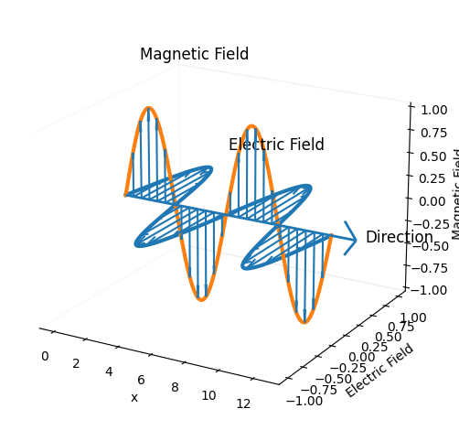
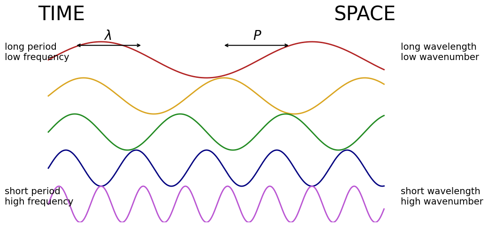
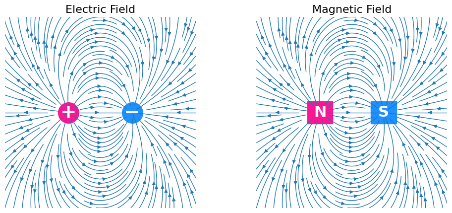

# Electromagnetic Wave Analysis

## Useful Definitions and Formulas

## 1. General Form of an Electromagnetic Wave

---

A sinusoidal electromagnetic wave is commonly written as:

$$

E(x,t)=E_0\sin(kx-\omega t)

$$

where:

- $E_0$ — amplitude of the electric field

- $k$ — wave number

- $\omega$ — angular frequency

- $x$ — position

- $t$ — time

---

### 2. Direction of Propagation

For wave equations:

- $kx-\omega t$  → propagation in the $+x$ direction
- $kx+\omega t$  → propagation in the $-x$ direction

---

### 3. Wave Number and Wavelength

The wave number is related to wavelength by:

$$

k=\frac{2\pi}{\lambda}

$$

Therefore:

$$

\lambda=\frac{2\pi}{k}

$$

where:

- $k$ — wave number

- $\lambda$ — wavelength
---

### 4. Relationship Between Angular Frequency and Wave Speed

For electromagnetic waves in vacuum:

\omega=ck

where:

- $c=3.0\times10^8\ \mathrm{m/s}$ — speed of light
- $k$ — wave number

---

### 5. Relationship Between Electric and Magnetic Fields

For electromagnetic waves:

$$
E_0=cB_0
$$

Therefore:

$$
B_0=\frac{E_0}{c}
$$

where:

- $E_0$ — electric field amplitude
- $B_0$ — magnetic field amplitude
- $c$ — speed of light

---

# Step-by-Step Solution

## Step 1. Write the Given Wave Equation

The electric field is:

$$
E_y(x,t)=100\sin\left(10^7x-\omega t\right)\ \mathrm{V/m}
$$

From comparison with the standard form:

$$
E(x,t)=E_0\sin(kx-\omega t)
$$

we identify:

$$
E_0=100\ \mathrm{V/m}
$$

and:

$$
k=10^7\ \mathrm{rad/m}
$$

---

# Part 1. Determine the Direction of Propagation

The wave contains:

$$
kx-\omega t
$$

This corresponds to propagation in the positive $x$ direction.

---

# Answer

$$
\boxed{
\text{The wave propagates in the }+x\text{ direction.}
}
$$

---

# Part 2. Calculate the Wavelength

Use:

$$
\lambda=\frac{2\pi}{k}
$$

Substitute:

$$
\lambda=\frac{2\pi}{10^7}
$$

Calculate:

$$
\lambda\approx6.28\times10^{-7}\ \mathrm{m}
$$

---

# Answer

$$
\boxed{
\lambda\approx6.28\times10^{-7}\ \mathrm{m}
}
$$

or:

$$
\boxed{
\lambda\approx628\ \mathrm{nm}
}
$$

---

# Part 3. Calculate the Angular Frequency

Use:

$$
\omega=ck
$$

Substitute:

$$
\omega=3.0\times10^8\times10^7
$$

$$
\omega=3.0\times10^{15}\ \mathrm{rad/s}
$$

---

# Answer

$$
\boxed{
\omega=3.0\times10^{15}\ \mathrm{rad/s}
}
$$

---

# Part 4. Determine the Magnetic Field Equation

First calculate the magnetic field amplitude.

Use:

$$
B_0=\frac{E_0}{c}
$$

Substitute:

$$
B_0=\frac{100}{3.0\times10^8}
$$

$$
B_0\approx3.33\times10^{-7}\ \mathrm{T}
$$

---

Since:

- the electric field oscillates in the $y$ direction,
- the wave propagates in the $+x$ direction,

the magnetic field must oscillate in the $z$ direction according to the right-hand rule.

Thus the magnetic field equation is:

$$
B_z(x,t)=3.33\times10^{-7}\sin\left(10^7x-\omega t\right)\ \mathrm{T}
$$

---

# Final Answers

## Direction of Propagation

$$
\boxed{
\text{Propagation along the }+x\text{ axis}
}
$$

---

## Wavelength

$$
\boxed{
\lambda\approx6.28\times10^{-7}\ \mathrm{m}
}
$$

---

## Angular Frequency

$$
\boxed{
\omega=3.0\times10^{15}\ \mathrm{rad/s}
}
$$

---

## Magnetic Field Equation

$$
\boxed{
B_z(x,t)=3.33\times10^{-7}\sin\left(10^7x-\omega t\right)\ \mathrm{T}
}
$$

---

# Physical Interpretation

- The electric and magnetic fields oscillate perpendicular to each other.
- Both fields are also perpendicular to the direction of propagation.
- The wave travels in the positive $x$ direction.
- The wavelength lies in the visible-light range.
